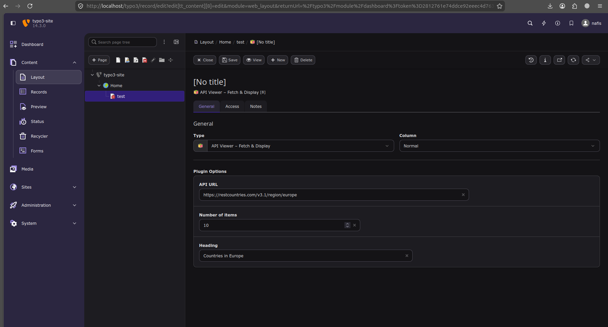

# TYPO3 API Viewer Extension

A TYPO3 v14 extension that fetches data from any public JSON API and displays it as a list on the frontend using Fluid templating.

Built as a learning project to demonstrate core TYPO3 development concepts.

---

## � Screenshots

<p align="center">
  
  
</p>

---

## �🚀 What it does

- **Backend editor** pastes any public API URL into a simple settings form
- **Extension fetches** the data automatically using TYPO3's built-in HTTP client
- **Fluid template** renders the results as a responsive card grid on the frontend

---

## 🗂 Project structure

```
api_viewer/
├── Classes/
│   ├── Controller/
│   │   └── ApiController.php       ← reads FlexForm settings, calls service
│   └── Service/
│       └── ApiService.php          ← HTTP fetch via TYPO3 RequestFactory
├── Configuration/
│   ├── FlexForms/
│   │   └── ApiPlugin.xml           ← backend settings form (URL, limit, heading)
│   ├── TCA/Overrides/
│   │   └── tt_content.php          ← registers plugin + attaches FlexForm
│   └── Services.yaml               ← dependency injection config
├── Resources/
│   ├── Private/
│   │   ├── Layouts/
│   │   │   └── Default.html        ← outer HTML wrapper
│   │   └── Templates/Api/
│   │       └── Index.html          ← Fluid list template
│   └── Public/
│       └── Css/
│           └── api_viewer.css      ← card grid styles
├── composer.json
├── ext_emconf.php                  ← extension metadata
└── ext_localconf.php               ← plugin registration
```

---

## ⚙️ Requirements

- TYPO3 **14.x**
- PHP **8.2+**
- Composer-based TYPO3 installation

---


** Install with Composer**

```bash
composer require nafise/api-viewer @dev
```

---

## 🖥 Usage in the backend

1. Go to **Content → Layout** in the TYPO3 backend
2. Click on your page in the page tree
3. Click **"+ Create new content element"**
4. Choose **"API Viewer – Fetch & Display"**
5. Fill in the **Plugin Options**:

```
First field  → https://restcountries.com/v3.1/region/europe
Second field → 12
Third field  → Countries in Europe
```

6. Click **Save**
7. View the page on the frontend ✅


---

## 📚 What I learned building this

- How TYPO3 extensions are structured (MVC with Extbase)
- How FlexForms work to give editors configurable plugins
- How Fluid templating works (`<f:for>`, `<f:if>`, ViewHelpers)
- How TYPO3's Dependency Injection container works (Services.yaml)
- How to use `RequestFactory` for HTTP calls the TYPO3 way
- How TCA Overrides connect backend configuration to plugins

---

## 👩‍💻 Author

Built by **Nafise** as a TYPO3 learning project.
